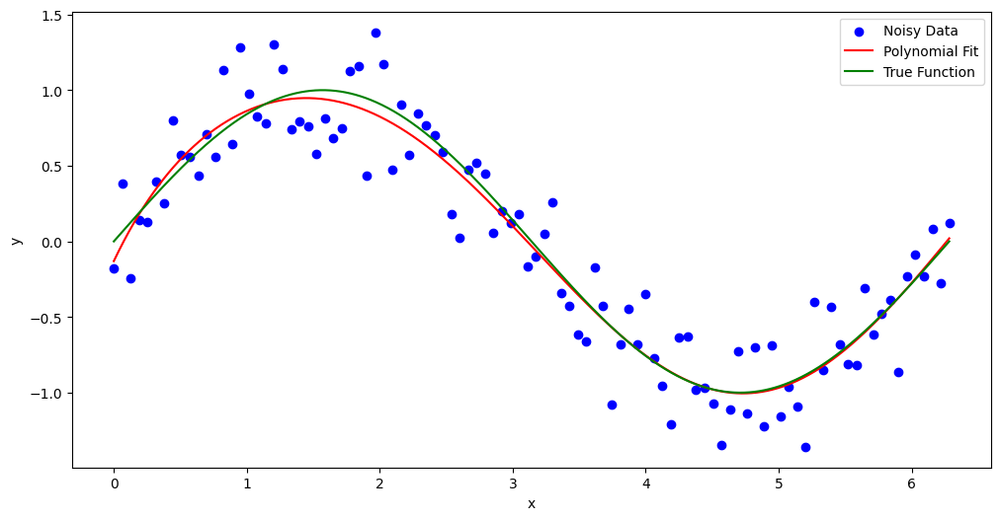
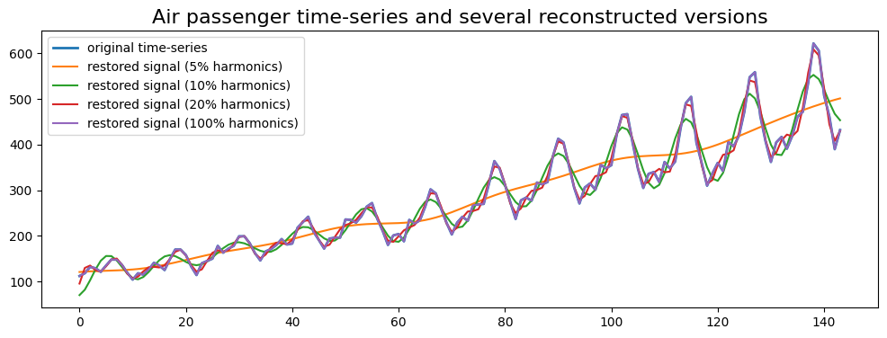

# 📈 Stochastic Signal Analysis & Time Series Modeling

<div align="center">


</div>

> **Explorando a matemática por trás da modelagem de dados ruidosos, inferência probabilística e decomposição de sinais.**

Este repositório reúne implementações focadas nos fundamentos estatísticos necessários para **Análise Quantitativa** e **Processamento de Sinais**. O objetivo não é apenas aplicar bibliotecas, mas investigar o comportamento matemático de modelos em cenários de incerteza.

---

## 🔬 Módulos de Estudo

### 1. Polynomial Regression & Overfitting
* **O Conceito:** Estudo do impacto da complexidade do modelo (grau do polinômio) no erro de generalização.
* **Aplicação em Finanças:** Entendimento visual do **Bias-Variance Tradeoff**. Mostra os perigos de "curve fitting" em backtests (ajustar demais o modelo aos dados passados).
  
### 2. Bayesian Hypothesis Selection
* **O Conceito:** Aplicação do Teorema de Bayes para selecionar a melhor hipótese dado um conjunto de dados ruidosos ($d$).
* **Aplicação em Finanças:** Fundamental para **Regime Switching** (detectar se o mercado mudou de tendência) e atualização de probabilidades em tempo real.
* **Técnica:** Cálculo da probabilidade *a posteriori* $P(h|d)$ baseada na verossimilhança.

### 3. Stochastic Signal Analysis
* **O Conceito:** Análise de sinais aleatórios, focando em propriedades estatísticas como média, variância e autocorrelação.
* **Aplicação em Finanças:** Modelagem de preços de ativos (Random Walks), análise de volatilidade e filtragem de ruído em séries temporais financeiras.

---

## 📊 Visualizações & Análise

### 1. Modelagem de Dados (Signal vs. Noise)
Ajuste de regressão polinomial sobre dados ruidosos. O desafio aqui é encontrar o equilíbrio entre capturar a tendência do sinal sem incorporar o ruído aleatório (evitando *overfitting*).

<div align="center">
  
  <p><i>Ajuste de modelo polinomial sobre amostra estocástica.</i></p>
</div>

### 2. Inferência Bayesiana (Conceito)
Para o módulo de Hipóteses Bayesianas, a análise é puramente probabilística. O algoritmo calcula a probabilidade *a posteriori* $P(h|D)$ de cada hipótese, atualizando a crença do modelo a cada novo dado observado, sem necessidade de re-treinamento total.

### 3. Processamento de Sinais Estocásticos
Análise visual de uma série temporal gerada por processos aleatórios. Este tipo de visualização é análogo ao estudo de retornos de ativos financeiros e análise de volatilidade.

<div align="center">
  
</div>

---

## 🛠️ Tech Stack
* **Core:** `NumPy`, `SciPy`
* **Visualization:** `Matplotlib`
* **Methodology:** Inferência Estatística, Cálculo Numérico.

## 🚀 Como Rodar
```bash
git clone https://github.com/cockles98/stochastic-signal-analysis.git
cd stochastic-signal-analysis
pip install numpy matplotlib scipy jupyter
jupyter notebook
```
