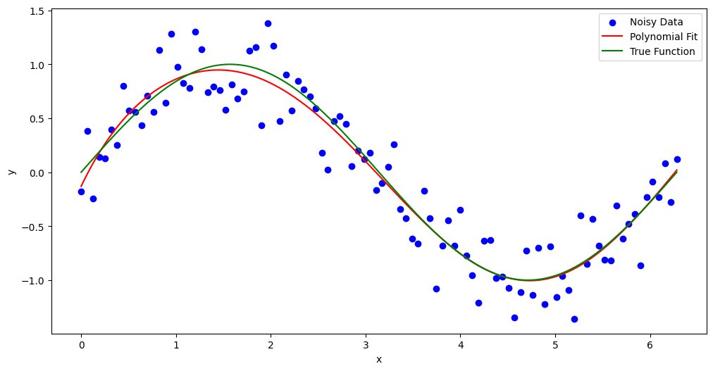
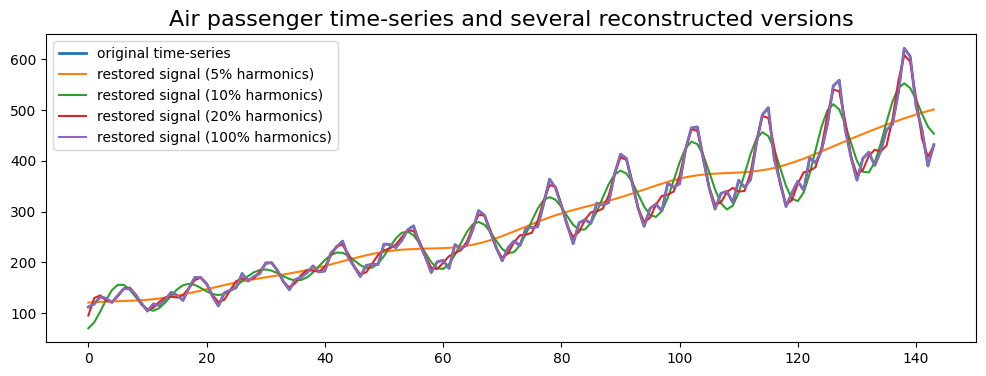

# 📈 Stochastic Signal Analysis & Time Series Modeling

<div align="center">


</div>

> **Exploring the mathematical foundations of noisy data modeling, probabilistic inference, and signal decomposition — with applications to quantitative finance.**

This repository collects implementations focused on the statistical fundamentals underlying **Quantitative Analysis** and **Signal Processing**. The goal is not to apply libraries out of the box, but to investigate the mathematical behavior of models under uncertainty — understanding *why* they work before *how* to use them.

---

## 🔬 Modules

### 1. Polynomial Regression & Overfitting
Studying the impact of model complexity (polynomial degree) on generalization error, with a focus on the **Bias-Variance Tradeoff**. Directly applicable to backtesting in finance — where overfitting to historical data is one of the most common sources of strategy failure.

### 2. Bayesian Hypothesis Selection
Applying Bayes' Theorem to select the best hypothesis given a noisy dataset. The algorithm computes the posterior probability $P(h|D)$ for each hypothesis, updating beliefs incrementally as new data arrives — without full retraining. Relevant to **Regime Switching** models and real-time probability updating in trading systems.

### 3. Stochastic Signal Analysis
Analyzing random signals with a focus on statistical properties: mean, variance, and autocorrelation. Analogous to the study of asset return distributions, volatility modeling, and noise filtering in financial time series.

---

## 📊 Visualizations

### Signal vs. Noise (Polynomial Fit)
Fitting a polynomial regression to noisy data. The challenge is finding the balance between capturing the true signal trend and avoiding incorporation of random noise.

<div align="center">
  
  <p><i>Polynomial model fit over a stochastic sample.</i></p>
</div>

### Stochastic Signal Waveform
Visual analysis of a time series generated by a stochastic process — analogous to asset return analysis and volatility decomposition.

<div align="center">
  
</div>

---

## 🛠️ Stack
- **Core:** `NumPy`, `SciPy`
- **Visualization:** `Matplotlib`
- **Methodology:** Statistical inference, numerical computation

---

## 🚀 Getting Started
```bash
git clone https://github.com/cockles98/stochastic-signal-analysis.git
cd stochastic-signal-analysis
pip install numpy matplotlib scipy jupyter
jupyter notebook
```
